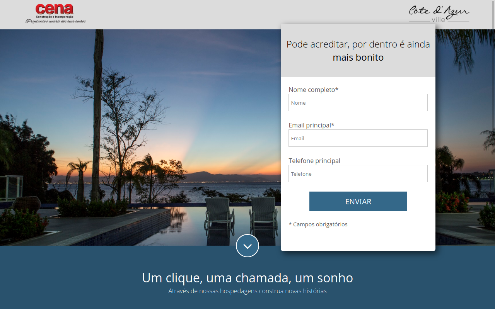

# Landing Page Hotelaria



Landing page para hotelaria, com cadastro em newsletter, responsiva e direcionada para otimização em mecanismos de busca. Feito inteiramente com:

- HTML5
- CSS3
- Javascript
- NodeJS + Express

## Motivação

Como principal motivação para o desenvolvimento da página web fora a prática dos conhecimentos em desenvolvimento front-end, assim como a integração com back-end utilizando NodeJS + Express. 

Todos os direitos sobre as imagens e projeto original recaem sobre a pessoa de Guilherme Cherem Grillo e a &copy;Danki Code, inscrita sobre o CNPJ 25.162.666/0001-77.

## Instalação e utilização

Para utilizar a aplicação bastar baixar o projeto através do Github ou via Git, através do comando:

```{bash}
git clone https://github.com/eng-gabrielscardoso/landing-page-hotelaria
```

Após o download, basta navegar até o diretório do projeto e instalar as dependências do projeto através do comando:

```{nodejs}
npm install
```

Com as dependências do projeto instaladas, basta rodar o comando para servir a página:

```{nodejs}
npm start
```

## Agradecimentos

Apesar da interface simples e propósito simples, o projeto auxiliou na prática do desenvolvimento web full-stack, bem como na possibilidade de escalar um projeto simples visto no curso de WebMaster FrontEnd, da &copy;Danki Code.

Agradeço a todos que testaram e contribuíram com o projeto

Siga-me em minhas redes:

[](https://www.linkedin.com/in/eng-gabrielscardoso/)
[](https://instagram.com/eng.gabrielscardoso)
[](https://wa.me/message/MIMKTQZXE6ABL1)
[](https://t.me/gabrielscardoso)